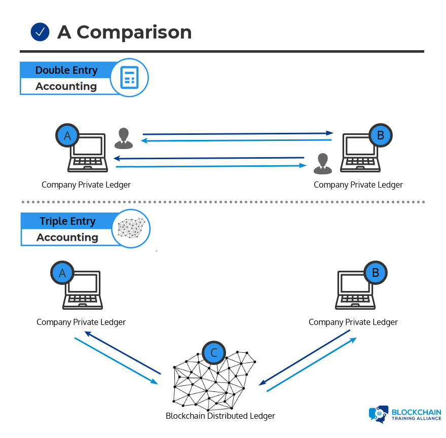
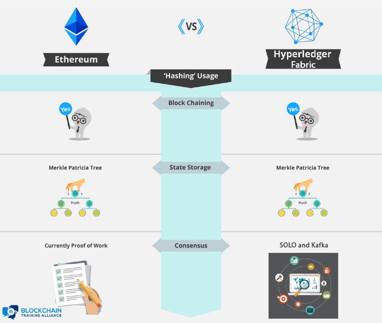
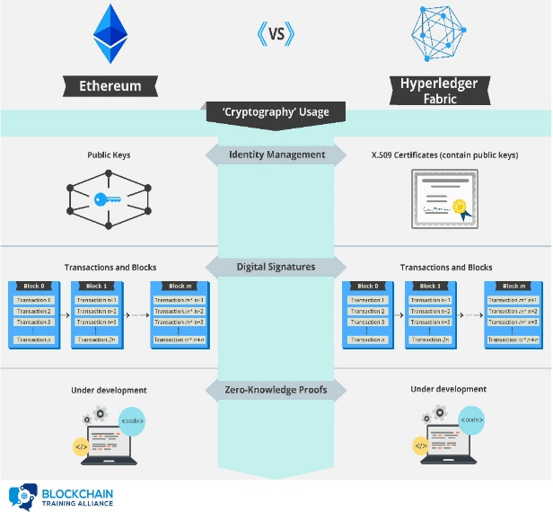

Double accounting:

Double-entry ledge (libro mayor)

Tracks debits and credits.

Italian Luca Pacioli, recognized as the father of accounting was the first
person to publish a work on double-entry

triple accounting:

>   is an enhancement to the traditional double-entry system, in which all
>   accounting entries involving outside parties are cryptographically sealed by
>   a third entry. The transaction is record in a public ledger

>   Tamper-Proof Records

>   Distributed Ledgers

>   Double-Entry+Cryptography

>   Validated, Secure, and Private

>   Digitally Signed Receipts.

Blockchain is the very first implementation of triple entry accounting, where we
have an asset being recorded on the ledger in the context of a transaction.

The third entry and triple entry accounting is cryptography, where we have a
cryptographic account of the transaction stored permanently and immutably on the
ledger.

A ledger is a collection of transactions.

It is not a collection of assets. Assets are part of a transaction, but the
ledger records the transaction.

In Blockchain all own the ledger, the ledger is distributed (decentralized) so
ther is a copy of the ledger in every node in the network

distributed ledger is a collection of data with no central administrator that
has been agreed upon by consensus.

Bitcoin is the most popular asset, first asset to be recorded as a transaction
on blockchain ledger

Ethereum and other publick blockchains allow you to have a permanent and
inmutable collection of code (smart contracts) that runs on the blockchain

smart contract is a program that runs on the blockchain.

Blockchain is a Network with its owns protocols

Nodes Make network computers own protocols to communicate with other nodes (Peer
Network) how that blockchain is put together, what are the protocols that define
the peers, and how those peers interact.

Private Membership Services: User authentication, authorization, and identity
management

Private Blockchain PKI, to provide a public key. And that public key represents
the identity of the user, But we also need a private key that each user can hold
to prove their identity stored in a wallet

Wallets collection of the user credentials encapsulates private keys and tracks
digital assets associated with the user's address

Blockchain self-ccointained

way to interact with the blockchain events: Notifications of updates and actions
on the blockchain

they have events that are fired when certain key actions are triggered.

Systems Management: Component creation, modification, and monitoring is designed
to be a long-lived system in a field that is constantly evolving

Systems Integration: Integration of blockchain with external systems.

Components of blockchain

1.  Ledger: A distributed, immutable historical record

2.  Peer Network: Stores, updates, and maintains the ledger, each node in this
    network maintains its own copy of the ledger.

3.  Membership Services: User authentication, authorization, and identity
    management

4.  Smart Contract: Program that runs on the blockchain

5.  Wallet: Stores users' credentials

6.  Events: Notifications of updates and actions on the blockchain like addition
    of a new block to the blockchain. Events may also include notifications from
    smart contracts on blockchains that support such contracts.

7.  Systems Management: provides the capability of creating, modifying, and
    monitoring blockchain components to meet the needs of its users.

8.  Systems Integration: Integration of blockchain with external systems.

Blockchain Actors

-   Architects: Designs and implements the backend code of the blockchain.

-   Operator: Join to create the peer network, the role of Operators (nodes) is
    to store copies of the ledger and keep their copy up to date.

-   Developer: design, write and upload smart contracts.

-   Regulator: Visibility into the historical ledger

-   End user: Consumers of the services of blockchain, using software that uses
    blockchain as a backend storage solution.

-   Data storage: is represented by traditional databases for storing data
    off-chain. The blockchain provides distributed, immutable storage with
    built-in integrity checking; however, it has a maximum capacity based on the
    standard block size and block rate. To provide integrity verification for
    large amounts of data, it is common to store the data off-chain and store a
    hash of the data on-chain. This guarantees that the data is not being
    modified while protecting the blockchain from becoming bloated.

-   Data processing: represented by an external system. Smart contract execute
    on the blockchain meaning that each node must execute the code to remain in
    sync.

Who Is Using Blockchain?

-   Healthcare

-   Voting

-   Supply and value chain

-   Artists

-   Business to Consumer (B2C)

    -    jewelry industry

-   Business to Business (B2B)

    -   Increase security documents

    -   Reduce dependence on paper and people

-   Dubai

    -   Smart Dubai 2021 move all governmental operations and record-keeping on
        the blockchain by the year 2021. Increased transparency in the
        government operations, increased efficiency,

Island of Yap

A great example of distribute or Decentralized ledger.

Todos en la isla sabían que le pertenecia que roca, cuando surguia un cambio una
transacción toda la isla se enteraba de esto y actualizaban su mente para saber
que ahora esa roca le pertenecia a otra persona actualizaban su ledger por así
decirlo, si alguien quería engañar a alguien tenia que engañar al 51% de la
isla.

Hoy en día los ledger son digitales almacenado en base de datos

This system of record, information across a global network, is what we call
decentralized ledgers.

When a recording is made, every participant is notified of that recording. They
now own an identical copy of the record of transactions, identical to every
other node on that network. Every piece of information on a blockchain can be
traced back to the exact moment when it was created. This allows blockchain to
serve as a truly reliable storage of public records and transactions, and
therefore eliminatingg the need for a centralized authority of database of
records.

Trust is created through two key principles: collaboration and cryptography.

Cryptography is a very old science Rose Greenhow spy who developed her own
method of encrypting data. Her own encryption scheme and she used this scheme to
mail letters down to the Confederate Army, revealing information. until finally
her encryption method was broken and she was actually one of the very first
people who were arrested and prosecuted by the Pinkertons (agencia detectives).

cryptography is simply designed defined as the science of sending messages back
and forth from one party to another, in the presence of adversaries or bad
actors, participants who may wish to corrupt or change the contents of a
message.

cryptographic functions are what we refer to as two-way functions, meaning that
we can take a secret and we can encrypt it, and then we can use that same
process to decrypt the secret at the other end.

-   **Secret**: The data which we are trying to protect

-   **Key**: A piece of data used for encrypting and decrypting the secret

-   **Function**: The process or function used to encrypt the secret

-   **Cipher**: The encrypted secret data, the output of the function.

**The Secret and the Key are passed into the Function to create the Cipher.**

cryptographic hashing is a very special class of cryptographic functions, which
are only one way, the output is encoded data know as the hash or a hash result
that is an encryption base on the data that I put in into the function. That is
mathematically impossible to reverse-engineer and this is what makes it a
one-way function the only method is to randomly guessing input until you're able
to recreate that hash output.. It is used where we want to prove a piece of data
without sharing that data.

>   Ejemplo a la hora de almacenar las passwords ya que así no se almacena la
>   password y no se sabe cual es su password solo se almacena el hash y se sabe
>   si metió mal la password o no ya que un hash es unico.

Byzantine Fault Tolerance en 1982 surgio un problema matemático llamado
Byzantine Generals Problem, el problema decía que hay dos imperios peleándose
uno en una ciudad con paredes y el otro rodenado con sus generales el muro
listos para atacar ambos tienen casi el mismo poder, pero si los de afuera los
generales atacan a la misma vez si ganan la batalla si no es simultaneo pierden,
¿Cómo se comunican los generales sabiendo que el mensaje no esta alterado
(tampering) o corrupto o si es veridico? La única manera de comunicarse era
mandar mensajeros a través de la ciudad. Fue resuelto en 2008 por Satoshi
Nakamoto, la solución que los generales contrataran la mayor cantidad de
matemáticos con el fin que tuvieran mas matemáticos los generales que los de la
ciudad así los matemáticos afuera de la ciudad podían encriptar el mensaje con
mas complejidad así los de adentro no tenían oportunidad de desencriptar el
mensaje, alterarlo y volverlo a encriptar de nuevo y si lo tenían se tomaba
mucho tiempo para que los generales no se dieran cuenta que algo estaba pasando.

Byzantine Fault Tolerance, nos referimos a los generales teniendo mas
matemáticos mas poder computacional.

Blockchains become secure if they have more computing power, more hash power in
the chain than off the chain. Por eso blockchain es tan Seguro por que supercar
el poder computacional de 30,000 nodos es muy difícil además que es muy caro

Criptografía que usa Blockchain

Public Key Cryptography

Pair of public and private keys used for encryption and digital signatures.

>   La llave privada puede firmar cualquier documento, y cualquiera con la llave
>   publica puede ver que fui yo el que lo firmo, ahora bien la llave publica
>   también se puede utilizar para encriptar cualquier información y el único
>   que la podrá desencriptar será la llave privada que pertenece a la llave
>   publica. Esta firma que se utiliza en el blockchain para transmitir que eres
>   el quien hizo esa transacción

Ciber-security in blockchain

Zero-Knowledge Proof or zk-snarks ("Zero-Knowledge Succinct Non-Interactive
Arguments of Knowledge")

Prove knowledge of a secret without revealing it.

Un ejemplo para entender esto seria una cueva que solo tiene una entrada y al
final de la cueva hay un puerte que para abrirla se necesita una contraseña,
para probar que se la contraseña sin revelarte la contraseña lo único que
necesito es entrar a la cueva y salir por la puerta de esta manera sabes que
tiene la contraseña pero nunca la da esto es zero-knowledge proof.

En blockchain el zero-knowledge proof the blockchain doesn't really need to know
or care who is spending the money, or how much total money they have the only
custion is does the user has enough money?

Zero-knowledge proofs are a cryptographic principle used in some blockchains to
increase the privacy of users.

Hash Functions

One-way pseudo-random mathematical functions and Merkle trees.

Public key Cryptography

Usa un par de llaves publicas y una llave privada que se mantiene en secreto

Usando la llave publica de alguien es posible encriptar un mensaje que solo la
llave privada puede desencriptar y leerlo

Using a private key, a digital signature can be created so that anyone with the
corresponding public key can verify that the message was created by the owner of
the private key and was not modified since.

Public key cryptography is used in the blockchain as a method for managing
users’ identities without revealing real world identities.

Hash Function

4 Properties:

1.  Puede recibir culquier cosa como input y siempre saca un output del mismo
    tamaño.

2.  Fácil calcular el hash, difícil decir cual es el input en base al output, la
    mejor manera es haciendo muchos intentos del input y comparar los outputs
    (fuerza bruta)(one way).

3.  Los output difieren por mucho a pesar que solo se cambie un bit esto para
    evitar algoritmos como “Hill climbing (Es un algoritmo iterativo que
    comienza con una solución arbitraria a un problema, luego intenta encontrar
    una mejor solución variando incrementalmente un único elemento de la
    solución.)”

4.  Casi imposible encontrar dos input que generen el mismo output

Cryptographic hashes give us a way to link all blocks on the blockchain together
in an immutable fashion

Hash functions are used as the cryptographic puzzle at the center of the Proof
of Work consensus algorithm or Proof of Stake.

El output de un hash también se le puede llamar “fingerprint”

Merkle trees:

Or hash tree es un arbol donde en cada hoja se almacena un hash y en el padre se
almacena el hash resultante de la unión de sus hijos. Permiten la verificación
of large data structures, fast and efficient validation data, permiten la
validacion de una transaccion en especifico sin necesitar toda la información.

Hyperledger Fabri vs Ethereum

Both Ethereum and Hyperledger Fabric are smart contract platforms that use a
particular type of Merkle tree called the **Patricia tree** to store the current
state of their virtual machine.

Difference between enconding and encryption

<https://danielmiessler.com/study/encoding-encryption-hashing-obfuscation/>
